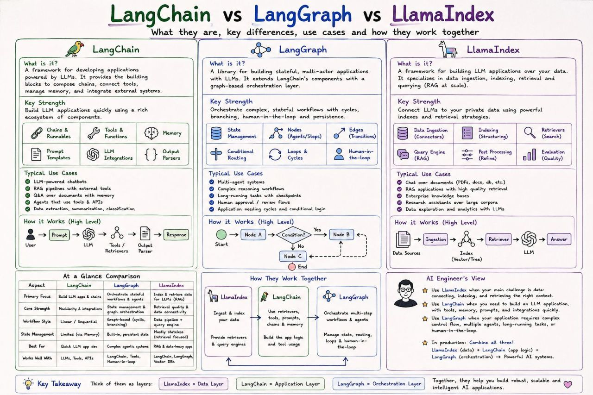

# Enterprise RAG Application

An enterprise-ready Retrieval-Augmented Generation (RAG) system combining **LlamaIndex**, **LangChain**, and **LangGraph**.

## Architecture Overview




- **LlamaIndex**: High-performance data ingestion, parsing, chunking, and local vector indexing.
- **LangChain**: Unified abstractions, tool schema generation, and LLM integrations.
- **LangGraph**: Stateful graph-based orchestration with tool-calling loops and routing.
- **FastAPI**: Production-grade async HTTP API.

---

## Quick Start (Local Setup)

### 1. Prerequisites
- Python 3.10+ (Python 3.11 recommended)
- OpenAI API Key

### 2. Environment Setup
```bash
# Create and activate a virtual environment
python3 -m venv .venv
source .venv/bin/activate  # Windows: .venv\Scripts\activate

# Install dependencies
pip install --upgrade pip
pip install -r requirements.txt
```

### 3. Configure Environment Variables
Copy `.env.example` to `.env` and configure your credentials:
```bash
cp .env.example .env
```
Edit `.env`:
```env
OPENAI_API_KEY=sk-your-actual-api-key-here
PORT=8000
HOST=0.0.0.0
```

### 4. Run the API Server
```bash
python -m src.main
```

The application starts at `http://localhost:8000`. Interactive OpenAPI documentation is available at `http://localhost:8000/docs`.

---

## Testing the Query Endpoint

Execute a test query using `curl`:

```bash
curl -X POST http://127.0.0.1:8000/query \
     -H "Content-Type: application/json" \
     -d '{"query": "What is the P99 SLA target for Project Titan?"}'
```

Expected Response:
```json
{
  "answer": "The SLA target for Project Titan's P99 latency is sub-12 milliseconds."
}
```

---

## Running with Docker

### Build & Run
```bash
docker build -t rag-enterprise-agent:latest .
docker run -d -p 8000:8000 --env-file .env --name rag_service rag-enterprise-agent:latest
```

### Check Logs and Health
```bash
docker logs -f rag_service
curl http://localhost:8000/health
```

---

## Project Structure
```text
rag-production-agent/
├── data/                       # Raw input documents for LlamaIndex
│   └── architecture_guide.txt
├── src/
│   ├── config.py               # Environment configuration
│   ├── ingestion.py            # LlamaIndex reader, chunker & index builder
│   ├── tools.py                # LangChain tool wrapper around LlamaIndex
│   ├── graph.py                # LangGraph stateful agent workflow
│   └── main.py                 # FastAPI application endpoints
├── .env.example                # Example environment variable file
├── Dockerfile                  # Production container definition
├── requirements.txt            # Python dependencies
└── README.md                   # Setup guide and API documentation
```
